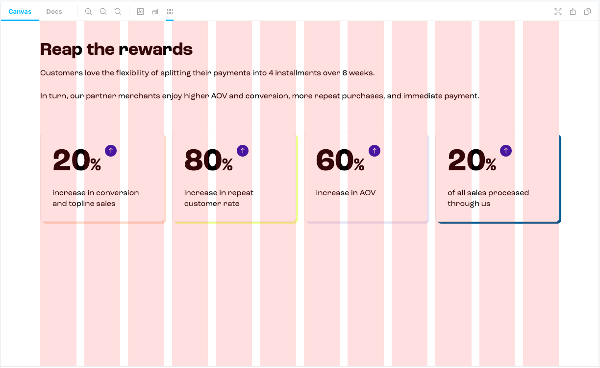

<div align="right">

<samp>

<h1></h1>

</samp>

`npm install storybook-addon-grid` keeps your stories in rhythm

[](https://npm-stat.com/charts.html?package=storybook-addon-grid)
[](https://bundlephobia.com/result?p=storybook-addon-grid)

<br />

<sup>

This is free to use software, but if you do like it, consider supporting me ❤️

[](https://github.com/sponsors/maraisr)
[](https://www.buymeacoffee.com/marais)

</sup>

</div>



## ⚙️ Install

```sh
npm install storybook-addon-grid
```

```js
// .storybook/main.js
module.exports = {
  addons: [require.resolve('storybook-addon-grid/preset')],
};
```

> <details>
> <summary>Chromatic users</summary>
>
> Include this additional preset to configure the column guides for your Chromatic screenshots.
>
> ```js
> // .storybook/main.js
> module.exports = {
>   addons: [require.resolve('storybook-addon-grid/preset'), require.resolve('storybook-addon-grid/chromatic')],
> };
> ```
>
> </details>

## 🚀 Usage

The column guides are controlled with [parameters](https://storybook.js.org/docs/react/writing-stories/parameters) and
as such you can define this globally or per story.

The column guides can be turned on either via clicking the toolbar button, or via a keyboard shortcut <kbd>Ctrl</kbd> +
<kbd>G</kbd>.

> **Note:** Due to the nature of `z-index`, the root `div` of the stories will have a `position: relative` and
> `z-index: 0` applied to it, allowing the column guides to sit over the top.

### _Parameters_

Column design system is defined by 3 values:

- the number of `columns`
- the `gap` between them
- the `gutter` — minimal margin between the system and the screen
- `maximal-width` for the system to limit maximum width of all columns as well.

#### `gridOn?: boolean = false`

Defines if the column guides should be turned on this story _by-default_. The guides are controlled with a toolbar item,
keyboard shortcut which may cause this to not _always_ be on. This will _force_ it to either be `on` or `off` when the
story is loaded.

#### `columns?: number = 12`

The number of columns guides.

#### `gap?: string = '20px'`

The gap between `columns`.

#### `gutter?: string = '50px'`

System's gutter (`margin`) for both left and right.

#### `gutterLeft?: string`

Define to override the gutter defined on the left-hand-side.

#### `gutterRight?: string`

Define to override the gutter defined on the right-hand-side.

#### `maxWidth?: string = '1024px'`

The maximum width our columns should grow.

#### `animation?: boolean = true`

Enable or Disable the guides from fading in or out when toggling the state.

> Chromatic users, this will be `false` by default.

#### `guidesColor?: string = 'rgba(255, 0, 0, 0.1)'`

Sets the color used for the column guides.

##### _Global Parameters~_

```js
// .storybook/preview.js
export const parameters = {
  grid: {
    gridOn: true,
    columns: 12,
    gap: '20px',
    gutter: '50px',
    maxWidth: '1024px',
  },
};
```

##### _Per story~_

```js
// MyComponent.stories.js

export const Example = () => {...};
Example.parameters = {
	grid: {
		columns: 6,
	},
};
```

## 📚 Further Readings

- https://compassofdesign.com/articles/design-principle-1-guides-gutters-and-grids

## ❤ Thanks

Special thanks to [Marina](https://github.com/thearnica) for the initial implementation and design.

## License

MIT © [Marais Rossouw](https://marais.io)
